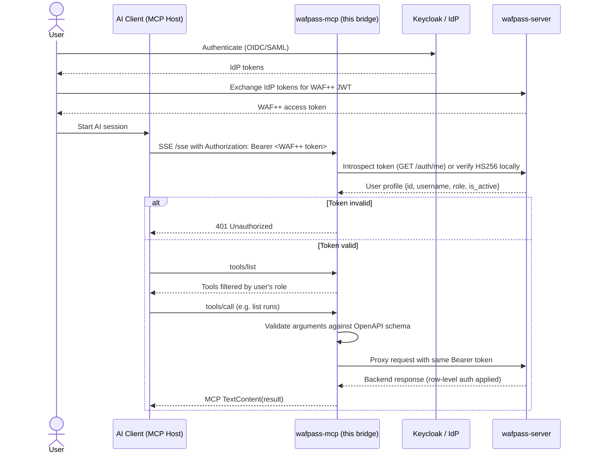

# WAF++ MCP Bridge


A secure [Model Context Protocol](https://modelcontextprotocol.io) server that exposes WAFpass (WAF++ backend) REST endpoints as MCP tools for AI assistants.

## Architecture



## Security model

- **IdP-agnostic**: The bridge does not talk to Keycloak/Entra/Okta directly. It trusts tokens issued by the upstream `wafpass-server`, which handles the actual OIDC/SAML flows.
- **OIDC pass-through**: The AI client inherits the user's WAF++ SSO context by presenting the same Bearer token.
- **Least privilege**: `tools/list` is filtered by the authenticated user's role. Unauthorized tools are invisible.
- **Context propagation**: Every backend call forwards the original `Authorization: Bearer` header so WAFpass can apply endpoint- and row-level authorization.
- **Strict validation**: Tool arguments are validated against Pydantic models generated from the WAFpass OpenAPI spec.

## Quick start

### Python (local)

```bash
# 1. Install dependencies
pip install -e ".[dev]"

# 2. Configure
cp .env.example .env
# Edit .env to point at your WAFpass backend and choose token validation mode.

# 3. Start the bridge
python -m wafpass_mcp.main
```

The SSE endpoint is available at `http://localhost:3001/sse`.

### Docker Compose (local development)

For local development the bridge can also be built from its `Dockerfile` and started alongside the rest of the WAF++ stack. From the repository root:

```bash
docker compose up -d wafpass-mcp
```

The service builds from `./wafpass-mcp`, depends on `wafpass-server`, and exposes port `3001`. Override `WAFPASS_TOKEN_MODE` or `WAFPASS_JWT_SECRET` via `.env` if you are not using the default introspection mode.

> **Release artifact:** `wafpass-mcp` is released as a Python package on PyPI. The `Dockerfile` exists only for local convenience in `docker-compose.yml`; the release workflow does not publish a Docker image.

## First-time setup

This guide covers installing the bridge, creating a WAF++ token, and connecting it to Claude Desktop. For most local use the recommended transport is **stdio**; an HTTPS-based HTTP/SSE alternative is documented below.

### 1. Install the bridge

```bash
git clone https://github.com/WAF2p/wafpass-mcp.git
cd wafpass-mcp
python3 -m venv .venv
source .venv/bin/activate
pip install -e ".[dev]"
```

This creates three console scripts in `.venv/bin`:

- `wafpass-mcp` — runs the HTTP/SSE bridge.
- `wafpass-mcp-stdio` — runs the stdio bridge for Claude Desktop.
- `wafpass-mcp-configure` — interactive login that stores credentials in the user's config directory.

### 2. Start the upstream WAFpass server

The bridge needs a running `wafpass-server` on `http://localhost:8000`. Follow the setup in `../wafpass-server/README.md`.

For local development, seed a bootstrap admin in `../wafpass-server/.env`:

```bash
WAFPASS_ADMIN_USERNAME=admin
WAFPASS_ADMIN_PASSWORD=changeme123
WAFPASS_ADMIN_ROLE=admin
```

The server creates this user automatically on first startup.

### 3. Log in and store credentials (recommended)

Run the interactive helper:

```bash
wafpass-mcp-configure
```

It prompts for the WAFpass API URL, username, and password, logs in, and stores the access token, refresh token, and URL in the user's config directory. The file is created with restrictive permissions (`0o600`) where the OS supports it.

After `wafpass-mcp-configure` succeeds, `wafpass-mcp-stdio` can start without any environment variables. It reads the stored config by default and refreshes the access token automatically before it expires.

> Access tokens expire after `WAFPASS_JWT_EXPIRE_MINUTES` (default 60). Keeping the refresh token in the stored config lets the stdio bridge refresh the access token automatically.

#### Alternative: manual token creation

If you prefer not to store credentials, or you are configuring a headless/CI environment, create a token pair manually and pass it through environment variables:

```bash
RESP=$(curl -s -X POST http://localhost:8000/api/v1/auth/login \
  -H "Content-Type: application/json" \
  -d '{"username":"admin","password":"changeme123"}')

export ACCESS_TOKEN=$(echo "$RESP" | jq -r .access_token)
export REFRESH_TOKEN=$(echo "$RESP" | jq -r .refresh_token)

echo "Access:  $ACCESS_TOKEN"
echo "Refresh: $REFRESH_TOKEN"
```

If you don't have `jq`, inspect the raw JSON response and copy the two token values manually.

### 4. Configure Claude Desktop (stdio — recommended)

The best way to use the bridge locally with Claude Desktop is to run it as a stdio command. This avoids HTTPS certificates, open ports, and TLS termination entirely.

Because credentials are now stored by `wafpass-mcp-configure`, the Claude Desktop config only needs the command path:

```json
{
  "mcpServers": {
    "wafpass": {
      "command": "/Users/lewandos/git/waf++/wafpass-mcp/.venv/bin/wafpass-mcp-stdio"
    }
  }
}
```

Place the file in Claude Desktop's MCP config location and restart Claude Desktop:

- **macOS**: `~/Library/Application Support/Claude/claude_desktop_config.json`
- **Windows**: `%APPDATA%\Claude\claude_desktop_config.json`

The exact path can be opened from Claude Desktop via **Settings → Developer → Edit Config**.

After restarting, open a new chat and look for the WAFpass tools in the tool picker (or ask Claude to list them). You should see tools like `list_runs_runs_get`, `get_run_runs__run_id__get`, etc., filtered by the token's role.

#### Overriding the stored config with environment variables

Environment variables take precedence over the stored config. This is useful for testing, CI, or switching backends without re-running `wafpass-mcp-configure`:

```json
{
  "mcpServers": {
    "wafpass": {
      "command": "/Users/lewandos/git/waf++/wafpass-mcp/.venv/bin/wafpass-mcp-stdio",
      "env": {
        "WAFPASS_ACCESS_TOKEN": "<WAF++_TOKEN_HERE>",
        "WAFPASS_REFRESH_TOKEN": "<WAF++_REFRESH_TOKEN_HERE>",
        "WAFPASS_API_BASE_URL": "http://localhost:8000",
        "WAFPASS_TOKEN_MODE": "introspection",
        "WAFPASS_REFRESH_THRESHOLD_SECONDS": "300"
      }
    }
  }
}
```

### 5. Alternative: HTTPS setup with mkcert

If your MCP client requires HTTP/SSE over `https://` instead of stdio, you can run the bridge behind a trusted local certificate generated with [mkcert](https://github.com/FiloSottile/mkcert).

#### Install and trust the local CA

**macOS:**

```bash
brew install mkcert
mkcert -install
```

The `-install` step adds the local CA to the macOS system and login keychains; most browsers and HTTP clients trust it immediately.

**Windows:**

```powershell
# Use Chocolatey or download the binary from GitHub
choco install mkcert
mkcert -install
```

You may need to restart browsers or add the generated CA certificate to the Windows certificate store manually. See the mkcert README for the latest Windows instructions.

**Linux:**

```bash
# Install from your distribution or download the binary
curl -JLO https://github.com/FiloSottile/mkcert/releases/download/v1.4.4/mkcert-v1.4.4-linux-amd64
chmod +x mkcert-v1.4.4-linux-amd64
sudo mv mkcert-v1.4.4-linux-amd64 /usr/local/bin/mkcert
mkcert -install
```

On Linux the CA is installed under `$HOME/.local/share/mkcert`; some browsers need it imported manually.

#### Generate a certificate for localhost

```bash
mkcert localhost 127.0.0.1 ::1
# Produces: localhost.pem (cert) and localhost-key.pem (key)
```

#### Run the bridge with TLS

```bash
uvicorn wafpass_mcp.main:app \
  --host 0.0.0.0 \
  --port 3001 \
  --ssl-keyfile ./localhost-key.pem \
  --ssl-certfile ./localhost.pem
```

The SSE endpoint is now `https://localhost:3001/sse`. The certificate files are already ignored by `.gitignore` so they will not be committed.

### Notes for stdio mode

- In stdio mode, credentials are read from the stored config file by default. Environment variables override the stored values, so `WAFPASS_ACCESS_TOKEN` is only required when no config has been saved.
- `WAFPASS_REFRESH_TOKEN` is optional but strongly recommended so the bridge can refresh the access token before it expires.
- The bridge logs to **stderr**; stdout is reserved for the MCP protocol.
- Token refresh only happens in stdio mode. HTTP/SSE clients must provide a fresh access token with every SSE connection.

## Alternative: HTTPS setup for HTTP/SSE clients

If you prefer to keep using the HTTP/SSE transport (for remote AI hosts, browser-based clients, or because your MCP client does not support stdio), you need a TLS termination layer in front of the bridge because most HTTPS-only MCP clients refuse plain `http://` URLs. Below are three working approaches for local development and testing.

### Option A: ngrok (quickest public HTTPS URL)

[ngrok](https://ngrok.com) gives you an HTTPS tunnel to `localhost:3001` without touching certificates.

1. Install ngrok and authenticate (`ngrok authtoken <token>`).
2. Start the bridge normally:
   ```bash
   python -m wafpass_mcp.main
   ```
3. In another terminal expose it:
   ```bash
   ngrok http 3001
   ```
4. Copy the generated `https://` URL (e.g. `https://xxxx.ngrok-free.app`).
5. Configure your MCP client to use that URL for the SSE endpoint, and keep sending `Authorization: Bearer <WAF++ token>`:
   ```
   https://xxxx.ngrok-free.app/sse
   ```

> The free ngrok tier gives a random URL on every restart. For a stable address use a paid/ngrok-static domain or switch to Cloudflare Tunnel.

### Option B: mkcert + uvicorn with TLS (local trusted certificate)

[mkcert](https://github.com/FiloSottile/mkcert) creates a certificate that your OS and browsers trust locally. This is the cleanest setup for repeated local testing with Claude Desktop.

1. Install mkcert and create a local CA:
   ```bash
   mkcert -install
   ```
2. Generate a certificate for `localhost` (and any local DNS you use):
   ```bash
   mkcert localhost 127.0.0.1 ::1
   # Produces: localhost.pem (cert) and localhost-key.pem (key)
   ```
3. Start uvicorn directly with the certificate files:
   ```bash
   uvicorn wafpass_mcp.main:app \
     --host 0.0.0.0 \
     --port 3001 \
     --ssl-keyfile ./localhost-key.pem \
     --ssl-certfile ./localhost.pem
   ```
4. The SSE endpoint is now available at:
   ```
   https://localhost:3001/sse
   ```
5. Keep the key and certificate files out of git (they are already ignored by the default `.gitignore` patterns for `*.pem`).

> The built-in `python -m wafpass_mcp.main` entry point does not expose uvicorn's TLS flags. Use `uvicorn` directly, or set `MCP_PORT` / other settings via environment variables as usual.

### Option C: Caddy reverse proxy (automatic local HTTPS)

[Caddy](https://caddyserver.com) can obtain and serve a local HTTPS certificate automatically.

1. Create a `Caddyfile` in the repo root:
   ```
   localhost:3443 {
       reverse_proxy localhost:3001
   }
   ```
2. Start the bridge on its default port:
   ```bash
   python -m wafpass_mcp.main
   ```
3. Run Caddy in another terminal:
   ```bash
   caddy run
   ```
4. Connect your MCP client to:
   ```
   https://localhost:3443/sse
   ```

Caddy will handle TLS for the client and proxy plain HTTP to the bridge.

### Updating the test scripts for HTTPS

The example scripts in `scripts/` use `http://localhost:3001`. When testing an HTTPS endpoint, change the URLs in those scripts (or pass them as arguments) to the HTTPS address, e.g.:

```python
SSE_URL = "https://localhost:3001/sse"
post_url = f"https://localhost:3001{endpoint}"
```

### HTTPS/SSE client configuration example

Once you have an HTTPS endpoint, add it to an MCP host that supports HTTP/SSE (e.g. a remote Claude Code instance or another MCP client):

```json
{
  "mcpServers": {
    "wafpass": {
      "url": "https://localhost:3001/sse",
      "headers": {
        "Authorization": "Bearer <WAF++_TOKEN>"
      }
    }
  }
}
```

> Replace `<WAF++_TOKEN>` with a real token obtained from your WAFpass backend. Automatic refresh is only available in stdio mode; HTTP/SSE clients must provide a fresh token with every SSE connection.

## Configuration

Settings can come from two places. `wafpass-mcp-configure` writes them to the user's config directory; environment variables override the stored values.

| Variable | Default | Description |
|----------|---------|-------------|
| `WAFPASS_API_BASE_URL` | `http://localhost:8000` | Upstream WAFpass API |
| `WAFPASS_TOKEN_MODE` | `introspection` | `introspection` (call `/auth/me`) or `jwt_secret` (local HS256) |
| `WAFPASS_JWT_SECRET` | *(empty)* | Required for `jwt_secret` mode; must match backend secret |
| `WAFPASS_ACCESS_TOKEN` | *(empty)* | WAF++ token for stdio mode; optional if stored by `wafpass-mcp-configure` |
| `WAFPASS_REFRESH_TOKEN` | *(empty)* | Opaque refresh token for automatic access-token refresh in stdio mode |
| `WAFPASS_REFRESH_THRESHOLD_SECONDS` | `300` | Refresh the access token if it expires within this many seconds |
| `MCP_HOST` | `0.0.0.0` | Bridge bind host (HTTP/SSE mode) |
| `MCP_PORT` | `3001` | Bridge bind port (HTTP/SSE mode) |
| `LOG_LEVEL` | `INFO` | Logging level |

The stored config file location depends on the OS:

- **macOS**: `~/Library/Application Support/wafpass-mcp/settings.json`
- **Linux**: `~/.config/wafpass-mcp/settings.json`
- **Windows**: `%APPDATA%\wafpass-mcp\settings.json`

## Token validation modes

- **introspection** (recommended): The bridge calls `GET /auth/me` on WAFpass for every new SSE connection. This is IdP-agnostic, works with any backend secret rotation, and lets WAFpass revoke tokens instantly.
- **jwt_secret**: The bridge verifies the HS256 signature locally. Faster but requires sharing the secret and does not detect token revocation.

## Tool registration and role filtering

At startup the bridge fetches `http://<WAFPASS_API_BASE_URL>/openapi.json` and converts each safe operation into an MCP tool:

- Tool names use the OpenAPI `operationId` when present (e.g. `list_runs_runs_get`, `get_run_runs__run_id__get`), otherwise a generated name like `get_health`.
- Path parameters become required tool arguments.
- Query parameters become optional tool arguments.
- Request bodies become top-level tool arguments.
- Operations in `SKIP_OPERATIONS` (login, OIDC callbacks, etc.) are never exposed.
- `ROLE_MAP` assigns a minimum required role per endpoint. The `list_tools` handler removes tools the caller's role cannot execute.

## Example tool call flow

Authenticated as an `engineer`:

```json
{
  "jsonrpc": "2.0",
  "id": 1,
  "method": "tools/list"
}
```

The response includes `list_runs_runs_get`, `get_run_runs__run_id__get`, `get_runs_id_findings_get`, etc., but not admin-only tools like `get_sso_config_sso_config_get`.

Verified against the live `../docker-compose.yml` stack: the bridge loads **113 tools** for `admin`, **102 tools** for `clevel`, and intermediate counts for higher roles.

Calling `list_runs_runs_get`:

```json
{
  "jsonrpc": "2.0",
  "id": 2,
  "method": "tools/call",
  "params": {
    "name": "list_runs_runs_get",
    "arguments": {"limit": 5}
  }
}
```

The bridge proxies this to `GET /runs?limit=5` with the user's Bearer token. WAFpass applies group-based row filtering and returns only the runs the user may see.

> Both the SSE `GET /sse` and every `POST /messages/` request must carry the same `Authorization: Bearer <WAF++ token>` header.

## Development

```bash
pytest
ruff check wafpass_mcp tests scripts
mypy wafpass_mcp tests scripts
```

These same checks run in GitHub Actions:

- `.github/workflows/ci.yml` — runs on every pull request and push to `main`.
- `.github/workflows/release.yml` — builds, runs lint/type/tests, publishes to PyPI, and creates a GitHub release on every push to `main`.

### Test scripts

`scripts/` contains standalone MCP-over-SSE clients for manual end-to-end checks:

```bash
# list all tools visible to the token's role
python scripts/mcp_list_tools.py <WAF++_TOKEN>

# call one tool and print the backend response
python scripts/mcp_call_tool_test.py <WAF++_TOKEN>

# minimal client that prints init + first 10 tools
python scripts/mcp_client_test.py <WAF++_TOKEN>
```

## Deployment notes

- Run behind a TLS-terminating reverse proxy in production.
- Prefer `WAFPASS_TOKEN_MODE=introspection` so the bridge does not need to store the JWT secret.
- Keep the bridge on a separate network path from the IdP; it only needs outbound access to WAFpass.

---

## Contributing and security

- `CONTRIBUTING.md` — how to set up local development, run tests, and open pull requests.
- `docs/mcp-desktop-setup.md` — step-by-step Claude Desktop installation and login guide.
- `TECH.md` — architecture, request lifecycle, OpenAPI mapping, and token validation details.
- `SECURITY.md` — supported versions, vulnerability reporting, and security-sensitive configuration.
- `CODE_OF_CONDUCT.md` — community standards and enforcement.
- `LICENSE` — Apache License 2.0.
