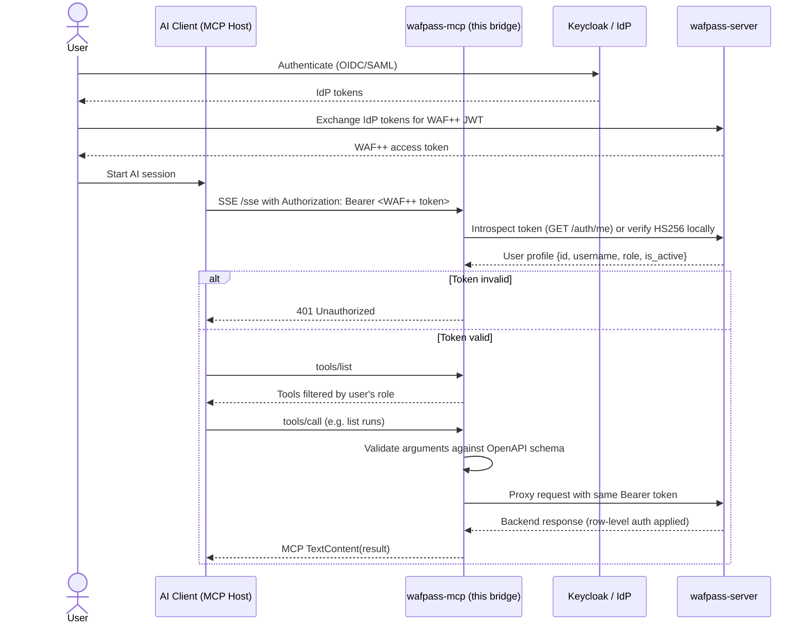

# WAF++ MCP Bridge

A secure [Model Context Protocol](https://modelcontextprotocol.io) server that exposes WAFpass (WAF++ backend) REST endpoints as MCP tools for AI assistants.

## Architecture



## Security model

- **IdP-agnostic**: The bridge does not talk to Keycloak/Entra/Okta directly. It trusts tokens issued by the upstream `wafpass-server`, which handles the actual OIDC/SAML flows.
- **OIDC pass-through**: The AI client inherits the user's WAF++ SSO context by presenting the same Bearer token.
- **Least privilege**: `tools/list` is filtered by the authenticated user's role. Unauthorized tools are invisible.
- **Context propagation**: Every backend call forwards the original `Authorization: Bearer` header so WAFpass can apply endpoint- and row-level authorization.
- **Strict validation**: Tool arguments are validated against Pydantic models generated from the WAFpass OpenAPI spec.

## Quick start

### Python (local)

```bash
# 1. Install dependencies
pip install -e ".[dev]"

# 2. Configure
cp .env.example .env
# Edit .env to point at your WAFpass backend and choose token validation mode.

# 3. Start the bridge
python -m wafpass_mcp.main
```

The SSE endpoint is available at `http://localhost:3001/sse`.

### Docker Compose (with the rest of the WAF++ stack)

From the repository root:

```bash
docker compose up -d wafpass-mcp
```

The service builds from `./wafpass-mcp`, depends on `wafpass-server`, and exposes port `3001`. Override `WAFPASS_TOKEN_MODE` or `WAFPASS_JWT_SECRET` via `.env` if you are not using the default introspection mode.

## Configuration

| Variable | Default | Description |
|----------|---------|-------------|
| `WAFPASS_API_BASE_URL` | `http://localhost:8000` | Upstream WAFpass API |
| `WAFPASS_TOKEN_MODE` | `introspection` | `introspection` (call `/auth/me`) or `jwt_secret` (local HS256) |
| `WAFPASS_JWT_SECRET` | *(empty)* | Required for `jwt_secret` mode; must match backend secret |
| `MCP_HOST` | `0.0.0.0` | Bridge bind host |
| `MCP_PORT` | `3001` | Bridge bind port |
| `LOG_LEVEL` | `INFO` | Logging level |

## Token validation modes

- **introspection** (recommended): The bridge calls `GET /auth/me` on WAFpass for every new SSE connection. This is IdP-agnostic, works with any backend secret rotation, and lets WAFpass revoke tokens instantly.
- **jwt_secret**: The bridge verifies the HS256 signature locally. Faster but requires sharing the secret and does not detect token revocation.

## Tool registration and role filtering

At startup the bridge fetches `http://<WAFPASS_API_BASE_URL>/openapi.json` and converts each safe operation into an MCP tool:

- Tool names use the OpenAPI `operationId` when present (e.g. `list_runs_runs_get`, `get_run_runs__run_id__get`), otherwise a generated name like `get_health`.
- Path parameters become required tool arguments.
- Query parameters become optional tool arguments.
- Request bodies become top-level tool arguments.
- Operations in `SKIP_OPERATIONS` (login, OIDC callbacks, etc.) are never exposed.
- `ROLE_MAP` assigns a minimum required role per endpoint. The `list_tools` handler removes tools the caller's role cannot execute.

## Example tool call flow

Authenticated as an `engineer`:

```json
{
  "jsonrpc": "2.0",
  "id": 1,
  "method": "tools/list"
}
```

The response includes `list_runs_runs_get`, `get_run_runs__run_id__get`, `get_runs_id_findings_get`, etc., but not admin-only tools like `get_sso_config_sso_config_get`.

Verified against the live `../docker-compose.yml` stack: the bridge loads **113 tools** for `admin`, **102 tools** for `clevel`, and intermediate counts for higher roles.

Calling `list_runs_runs_get`:

```json
{
  "jsonrpc": "2.0",
  "id": 2,
  "method": "tools/call",
  "params": {
    "name": "list_runs_runs_get",
    "arguments": {"limit": 5}
  }
}
```

The bridge proxies this to `GET /runs?limit=5` with the user's Bearer token. WAFpass applies group-based row filtering and returns only the runs the user may see.

> Both the SSE `GET /sse` and every `POST /messages/` request must carry the same `Authorization: Bearer <WAF++ token>` header.

## Development

```bash
pytest
ruff check wafpass_mcp tests scripts
mypy wafpass_mcp tests scripts
```

These same checks run in GitHub Actions:

- `.github/workflows/ci.yml` — runs on every pull request and push to `main`.
- `.github/workflows/release.yml` — builds, runs lint/type/tests, publishes to PyPI, and creates a GitHub release on every push to `main`.

### Test scripts

`scripts/` contains standalone MCP-over-SSE clients for manual end-to-end checks:

```bash
# list all tools visible to the token's role
python scripts/mcp_list_tools.py <WAF++_TOKEN>

# call one tool and print the backend response
python scripts/mcp_call_tool_test.py <WAF++_TOKEN>

# minimal client that prints init + first 10 tools
python scripts/mcp_client_test.py <WAF++_TOKEN>
```

## Deployment notes

- Run behind a TLS-terminating reverse proxy in production.
- Prefer `WAFPASS_TOKEN_MODE=introspection` so the bridge does not need to store the JWT secret.
- Keep the bridge on a separate network path from the IdP; it only needs outbound access to WAFpass.

---

## Contributing and security

- `CONTRIBUTING.md` — how to set up local development, run tests, and open pull requests.
- `TECH.md` — architecture, request lifecycle, OpenAPI mapping, and token validation details.
- `SECURITY.md` — supported versions, vulnerability reporting, and security-sensitive configuration.
- `CODE_OF_CONDUCT.md` — community standards and enforcement.
- `LICENSE` — Apache License 2.0.
